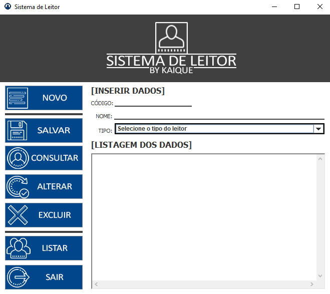

<h2 align="center">
  Aplicação Sistema de Leitor CRUD
</h2>

 <a href="#-sobre-o-projeto">Sobre</a> •
 <a href="#-tecnologias">Tecnologias</a> •
 <a href="#-site">Site</a> • 
 <a href="#-responsivo">Responsivo</a> • 
 <a href="#-como-executar">Executar</a> 

## 💻 Sobre o projeto

É uma aplicação para java na qual foi montada no modelo MVC. Ao executar o projeto, ele abre uma interface gráfica construida em java na qual você pode fazer iserções,
consultas, listagens, updates, e entre outros dos leitores.

---

## 🛠 Tecnologias

As seguintes ferramentas/Conceitor foram usadas na construção do projeto:

-   **Java**
-   **MySql**
-   Modelo Model-View-Controller

## 🚀 App

  

## 🛠 COMO EXECUTAR

Basta baixar os arquivos e compilar usando alguma IDE, como o eclipse por exemplo.

